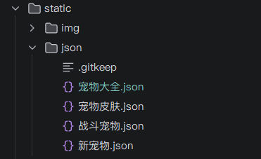
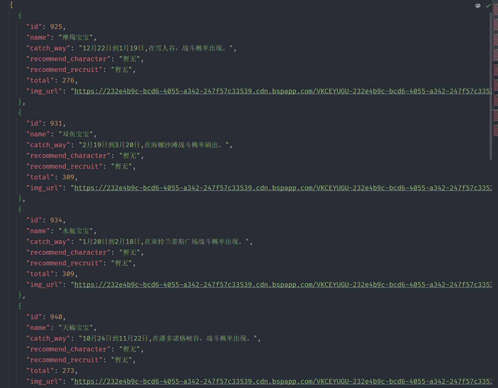
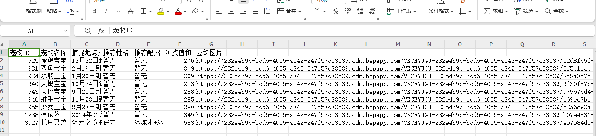

# 洛克王国查询图鉴

## 项目介绍

本项目用于整理和展示《洛克王国》宠物图鉴数据。

通过分析游戏客户端资源获取宠物图鉴,可以快速抓取未点亮的场景宠物

## 使用步骤

```shell
#1、打开lite端
https://17roco.qq.com/h5/
#2、打开控制台，top选index.html(一定要把top选index.html) index.html == res.17roco.qq.com
```


```shell
#3 点击图鉴，弹出这个图鉴的框
#3.1 点击近期新宠 然后把项目根目录的js文件 复制到控制台页面按回车，会自动导出json文件 然后 改名 新宠物.json
#3.2 点击外观大全 ..(同上)..  然后 改名 宠物皮肤.json
#3.2 点击破茧大全 ...(同上).. 改名 战斗宠物.json
#3.2 点击宠物大全 ..(同上)..  改名 宠物大全.json

#4、改完名存放到static/json/下面的目录,替换我的json文件

json 数据格式如下
  {
    "page": 1,         #页面 1
    "id": 1,           #宠物id
    "name": "喵喵",     # 名称 喵喵
    "unknown": false,  #unknown = false 从图鉴已经点亮
    "isNew": false,    # 没用 ，废案
    "isStarred": false #没用 ，废案
  },

#5、执行/src/down_load_img.py 从官网cdn下载图片
#其实也可以不下载图片,有了上面的4个json文件,直接执行find_catchable_missing.py
#如果不想使用网页端可以跳过5,同事后面不要执行main,只执行find_catchable_missing

#6、uv sync


#7、执行main
 uv run main.py
 查看地址:
 http://localhost:8000 
```


### 步骤3的样例




## 展示页面


## 项目tree说明

```rock_book


│ [自动翻页查询脚本.js] # 核心文件,一定要去洛克王国h5 的控制台执行，控制台的top记得选index
├── README.md        # 说明文件
├── rock_book       
│   └── index.html   # 展示文件
│   src
|       [down_load_img.py] # 从官网cdn下载图片,如果不想使用网页端可以跳过
├── static
│   ├── img          # rock图片
│   └── json         # 浏览器爬出下来的json数据
|   |-- roco_scene_pets_clean.json  #当前洛克王国版本全场景宠物,数据来源于洛克宝典
| find_catchable_missing.py
  1、会根据/static/json/*json 与 roco_scene_pets_clean.json 比对
  2、根据比对结果生成还未抓到场景宠物，有目标文件的josn版本和xlsx版本
├── main.py          # 启动文件
    会启动fastapi 想在网页手动改的可以打开网页,find_catchable_missing 输出的也挺直观的
  
```

## 温馨提示

如果不想使用网页端，使用自动翻页查询脚本.js这个脚本从官网lite获取的4个文件后，存放到static/json/ 下面

直接执行find_catchable_missing

**find_catchable_missing 生成的数据如下**






