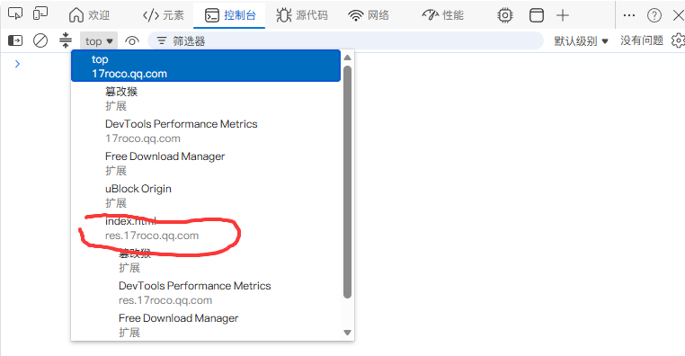
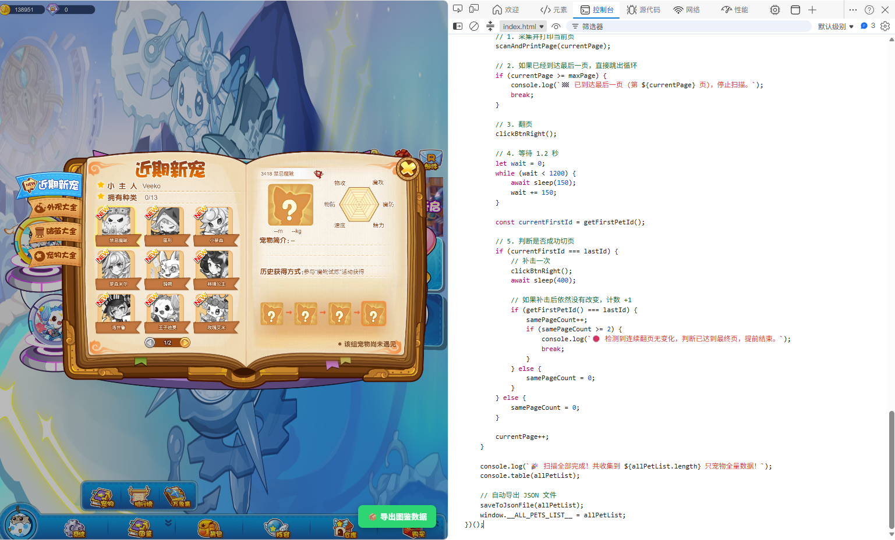
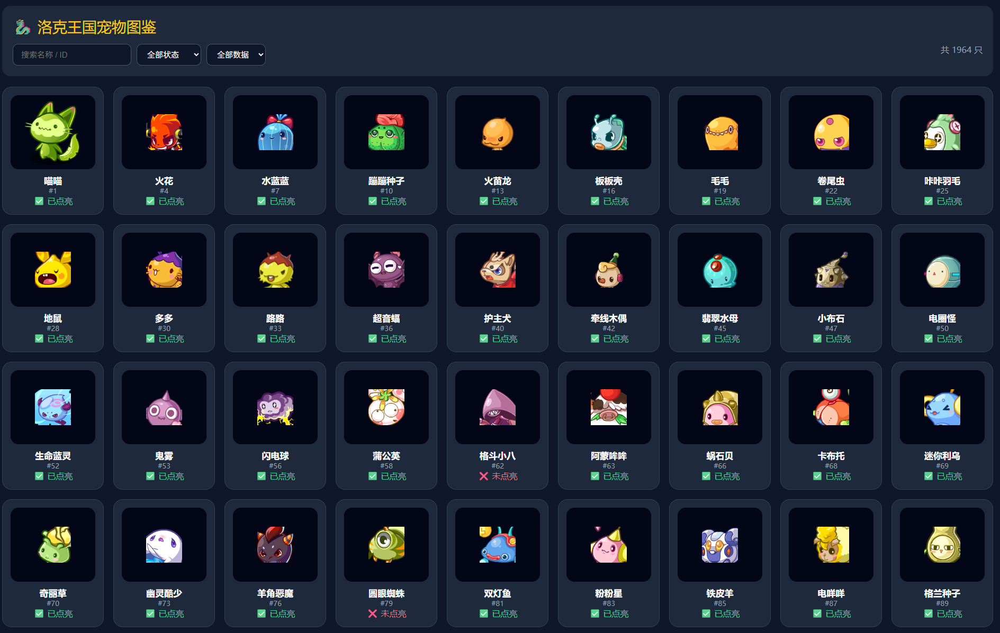
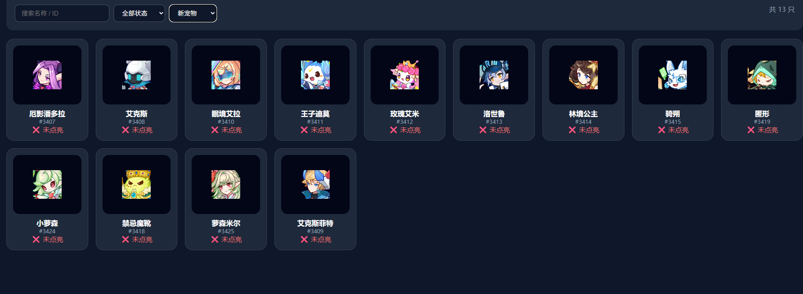
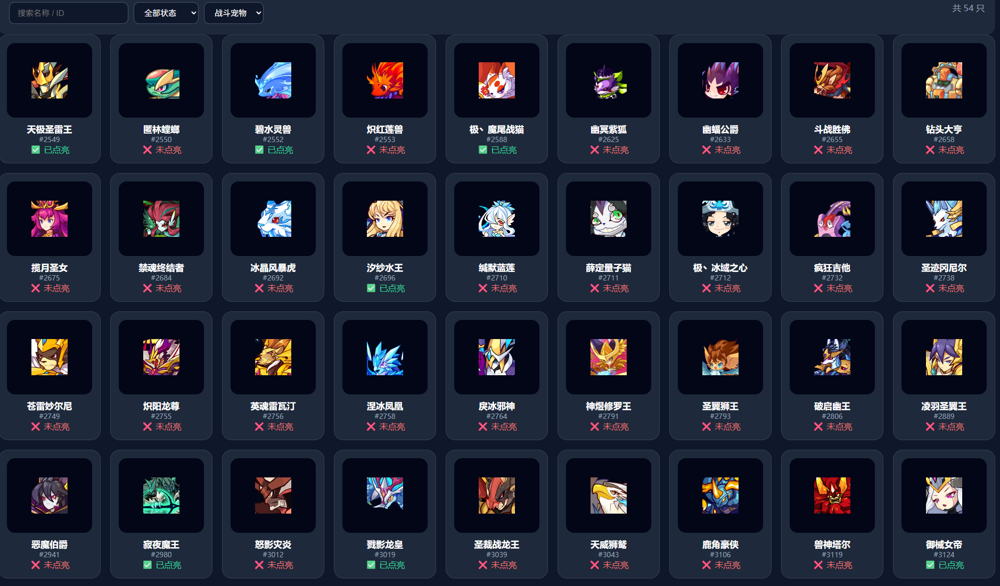
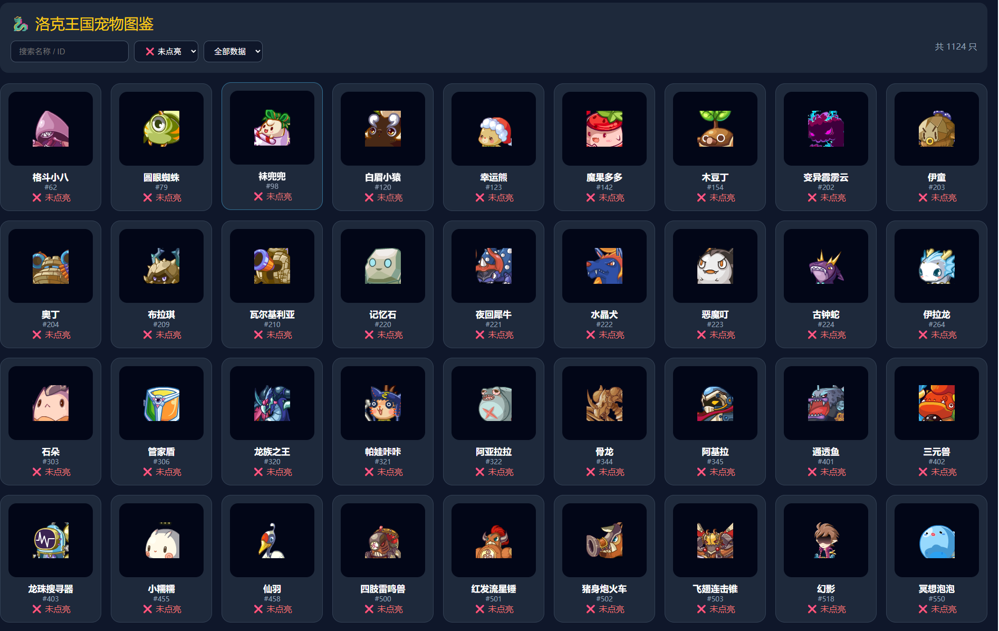

# 洛克王国宠物图鉴

## 项目介绍

本项目用于整理和展示《洛克王国》宠物图鉴数据。

通过分析游戏客户端资源，获取宠物图鉴：


一、使用步骤

```shell
#1、打开h5
https://17roco.qq.com/h5/
#2、打开控制台，top选index.html
```






```shell
#3、来到图鉴页面使用项目下的 自动翻页查询脚本.js 复制到控制台页面，会自动也然后导出

#4、导出然后改名成  宠物大全.json , 宠物皮肤.json , 战斗宠物.json 新宠物.json 存放到static/json/ 下面的目录

json 数据格式如下
  {
    "page": 1,   #页面 1
    "id": 1,     #宠物id
    "name": "喵喵",#名称 喵喵
    "unknown": false, #unknown = false 从图鉴已经点亮
    "isNew": false, #没用 ，废案
    "isStarred": false #没用 ，废案
  },

#5、执行/src/down_load_img.py 下载图片

#6、执行main
 查看地址:
 http://localhost:8000/rock_book/
```


展示页面












```rock_book
│
├── README.md        # 说明文件
├── main.py          # 启动文件
├── rock_book       
│   └── index.html   # 展示文件
│
├── static
│   ├── img          # rock图片
│   └── json         # 浏览器爬出下来的json数据

```

